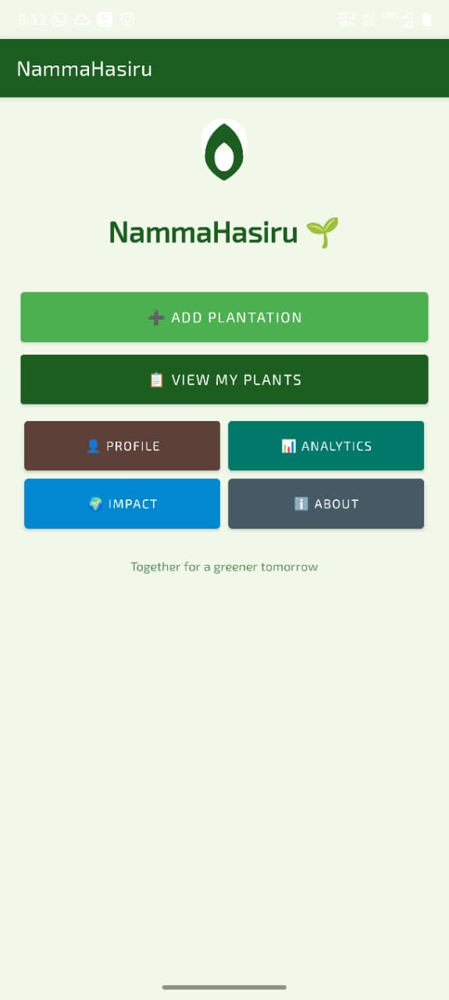
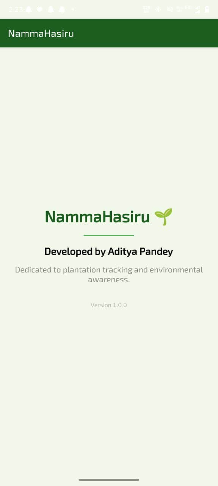
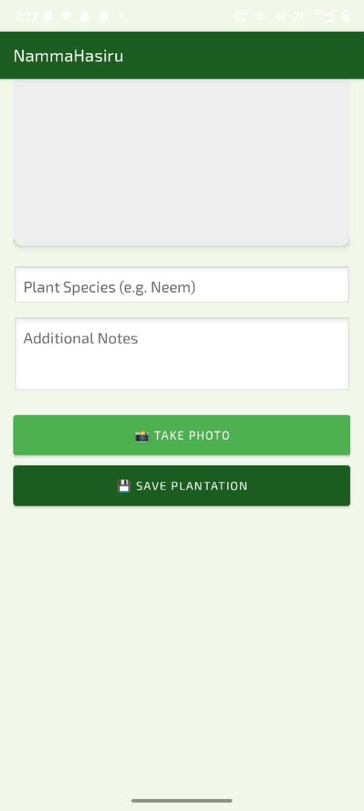
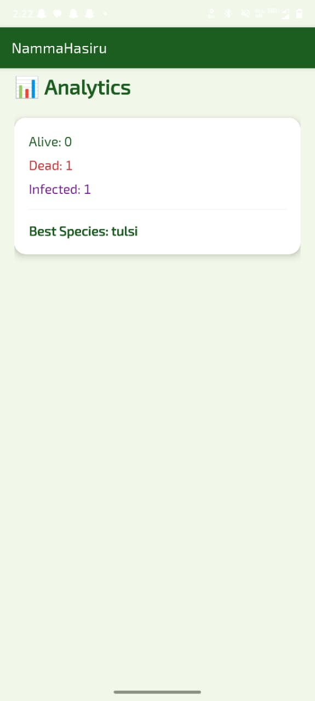
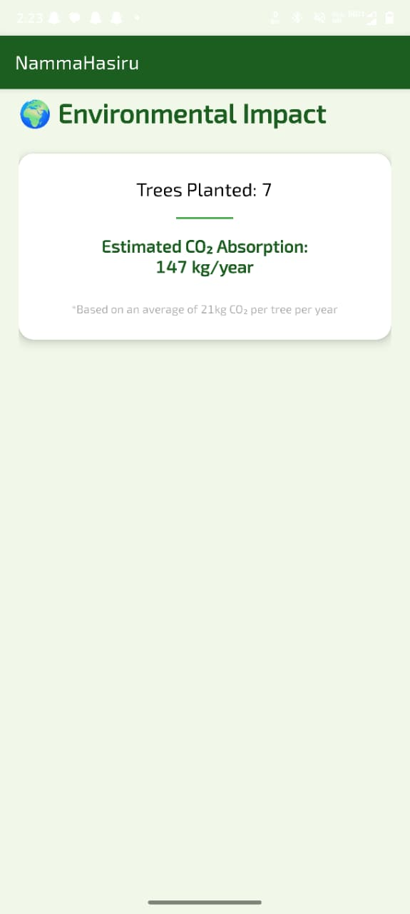
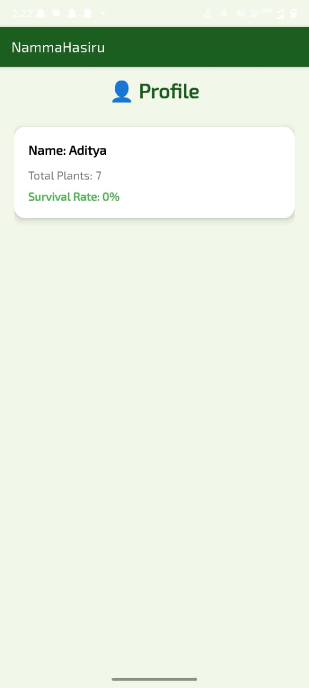
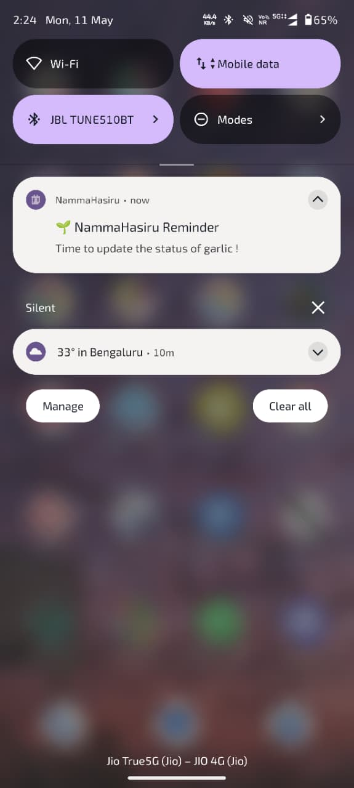
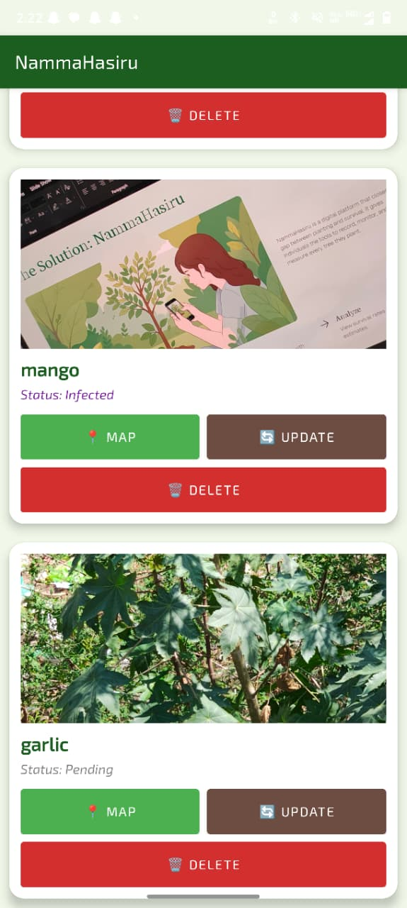

# NammaHasiru (Namma Hasiru)

An Android application to manage and track plants, view their details, add new plants with location and image, and set reminders.

## Screenshots

> Note: Images will render only after they are uploaded to GitHub under `/screenshots`.

- Home

  

- Add Plant (Loading)

  
  

- Analytics

  

- Impacts

  

- Profile

  

- Notification (Reminder)

  

- View Plant / Details

  

## Features

- Add plants (species, notes, image, latitude/longitude, status)
- View plant list and individual details
- Update plant info
- Analytics and impact screens
- Location support (Google Maps)
- Reminders using WorkManager + Notifications

## Tech Stack

- Kotlin
- Android SDK
- Room (local database)
- WorkManager (background reminders)
- Google Maps / Location services
- Glide (image loading)

## Setup (Android Studio)

1. Open `NammaHasiru2` in Android Studio.
2. Build and run.

### Google Maps API Key
The app expects a Google Maps API key in `AndroidManifest.xml`:
- `com.google.android.geo.API_KEY` is currently set to `YOUR_GOOGLE_MAPS_API_KEY`.

Replace it with your real API key.

## Author

AADITYA PANDEY

## License

MIT

